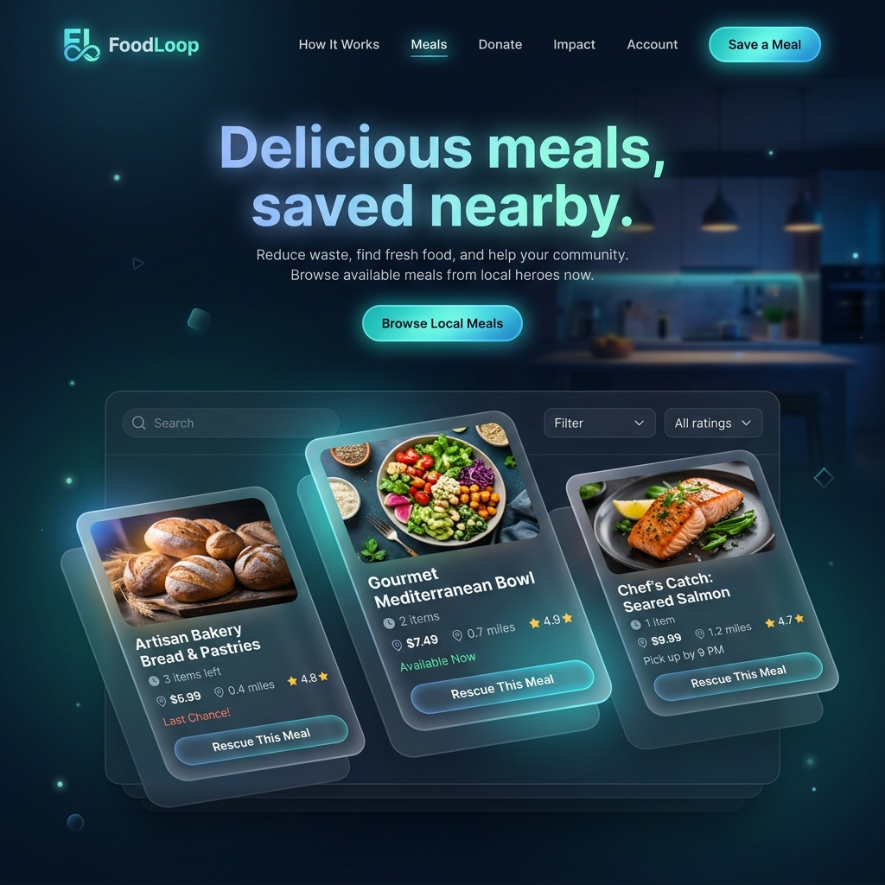
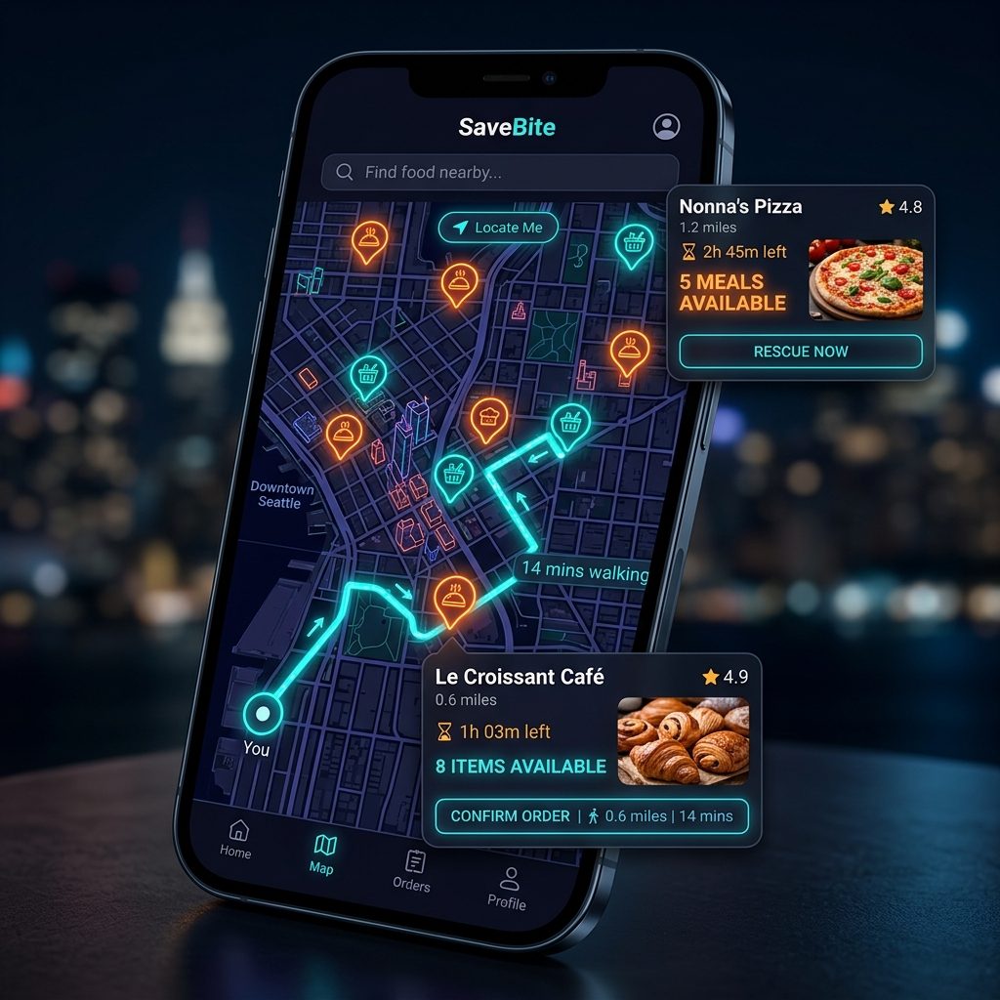
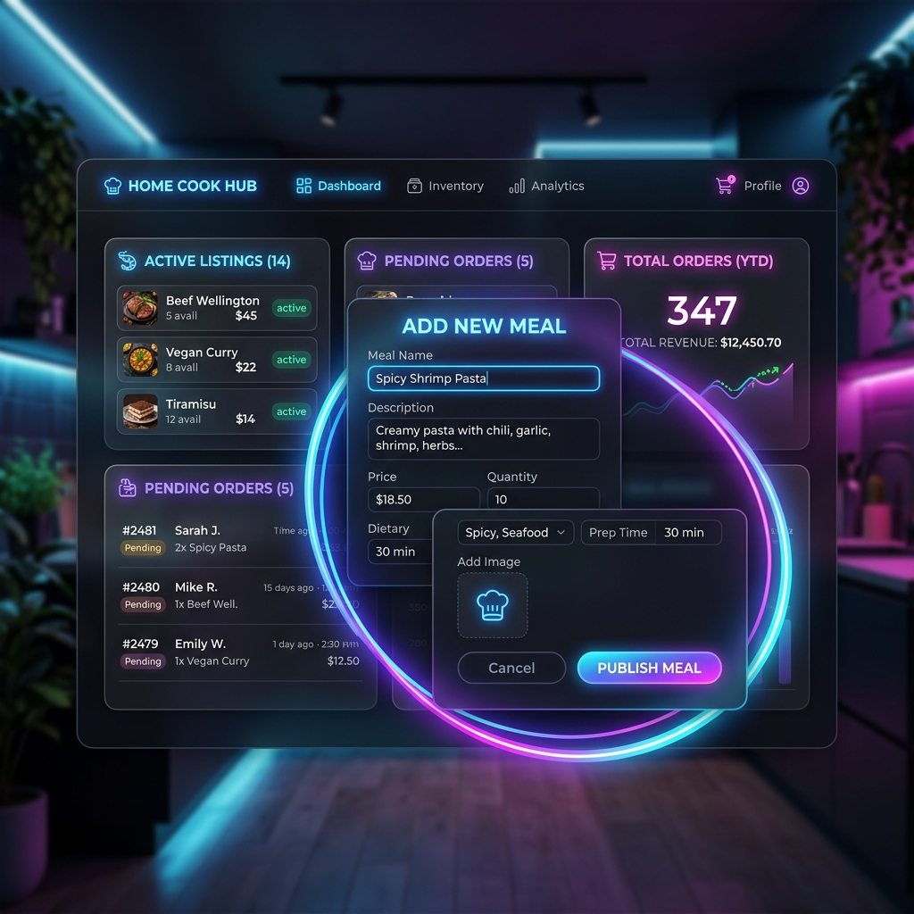
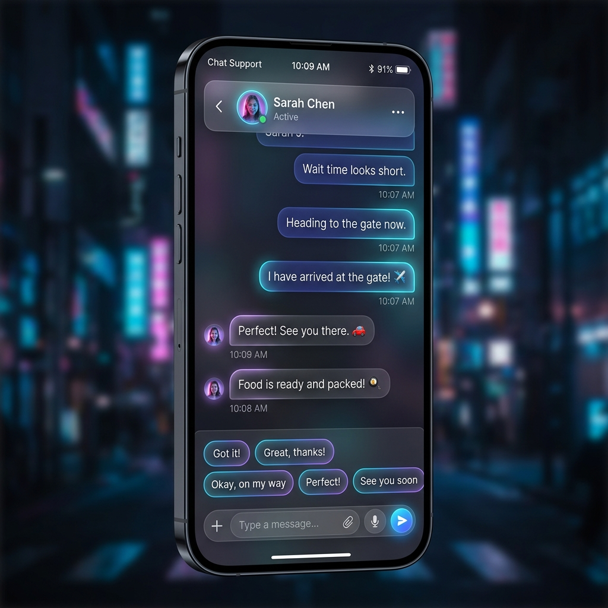
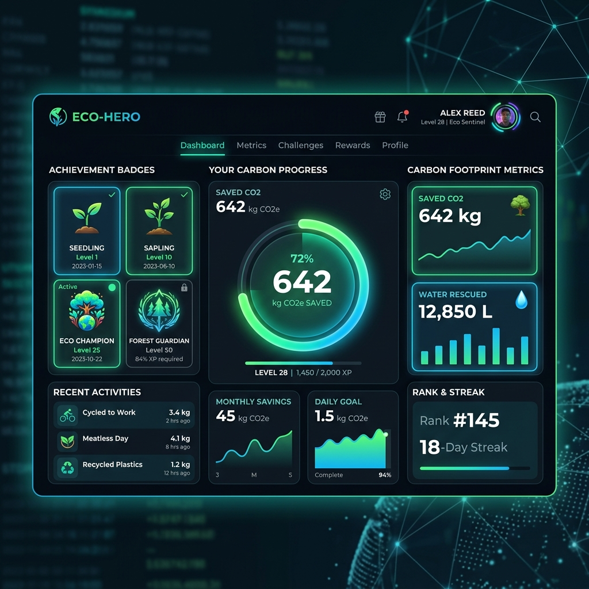

# 🥗 FoodLoop — Zero-Food-Waste Community Platform

FoodLoop is a futuristic, dark-glassmorphic Progressive Web Application (PWA) designed to eliminate food waste by connecting home cooks (sellers) with local neighbors (buyers). The platform enables cooks to list surplus portions of freshly cooked meals and allows buyers to discover, order, coordinate, and navigate to collect them in real-time.

---

## 📸 Key Project Screens & Visuals

Here are the visual outcomes and screenshots of the application:

### 1. Landing & Discovery Page
Sleek dark-glassmorphism hero section showcasing nearby home-cooked meals using interactive 3D perspective tilt cards.


### 2. Live Food Map & GPS Routing
Real-time Leaflet map displaying active cooks' locations with live ticking validation countdown timers in popups. Includes an ambient neon dashed polyline showing OSRM walk routing, distance, and duration between the buyer and seller.


### 3. Seller Dashboard & Publishing Form
Cooks dashboard showing total orders, completed order tallies, active listings, and an "Add New Meal" modal outlined in an animated glowing neon border light.


### 4. Real-Time Coordination Chat
Slide-out chat drawer built with frosted glass styling and sub-second message sync. Features quick-reply templates (e.g., *"Outside the gate"*, *"Food is ready! 🍳"*) for rapid mobile interaction.


### 5. Eco-Hero Gamification Ledger
Community leaderboard computing rescued meals, saved CO₂ (2.5 kg per meal), water saved (150 liters per meal), and equivalent tree days. Updates badges (Seedling, Sapling, Eco Champion, Forest Guardian) as user saves food.


---

## ⚡ Core Technological Outcomes

1. **⌛ Real-Time Map Expiry & Timers:**
   * Sellers specify validation durations. Map pins show live second-by-second countdown clocks.
   * Leverages client-side clock ticking matched with Firestore `onSnapshot` listeners to immediately delete expired listings from both the card feed and map markers in real-time without page reloads.

2. **🔮 3D Perspective Mouse Tilt Physics:**
   * Interactive cards tilt on X/Y axes and scale (`scale3d(1.02, 1.02, 1.02)`) on hover.
   * Employs `preserve-3d` and `translateZ(15px)` depth layers to float title tags above the background image for a premium 3D holographic look.
   * Auto-bypasses computations on touchscreens to ensure lag-free mobile experiences.

3. **🗺️ OSRM Turn-by-Turn Walk Routing:**
   * Fetches coordinates and walking routes using the public Open Source Routing Machine (OSRM) API.
   * Renders routes dynamically using Leaflet custom dash polylines and centers viewport bounds.

4. **💬 Privacy-First Coordination Chats:**
   * Operates active coordination chats under `/chats/{orderId}` inside the Firebase Realtime Database (RTDB) with sub-second sync latency.
   * Automatically destroys RTDB chat paths upon order completion (OTP verification) or cancellation to maintain buyer-seller privacy.

5. **🍲 Size-Optimized Image Publishing:**
   * Pre-resizes uploaded photographs on the client canvas (max-width 450px, quality 0.7) to shrink payloads (~25KB) and guarantee uploads never exceed Firestore's 1MB document size limit.
   * Features a 3.5-second upload timeout race fallback which triggers miniature thumbnail strings to keep the publication flow fast and resilient.

---

## 🛠️ Technology Stack

* **Frontend Framework:** React 19 + Vite + React Router DOM 7
* **CSS & Themes:** Tailwind CSS v4 + Vanilla CSS Custom Tokens
* **Database & Auth:** Firebase Firestore (Real-Time Subscriptions) + Firebase Auth + Firebase RTDB
* **Maps:** React Leaflet 5 + Leaflet 1.9 + OSRM Foot Routing API
* **Icons:** Lucide React
* **Hosting:** Firebase Hosting (HTTPS SSL Certified)

---

## 🚀 How to Get Started Locally

1. **Clone the repository:**
   ```bash
   git clone https://github.com/VinayakAsole/foodloop.git
   cd foodloop/project/frontend
   ```
2. **Install dependencies:**
   ```bash
   npm install
   ```
3. **Set up Firebase configuration:**
   Create a `.env` file in the `project/frontend` directory and add your Firebase configuration credentials:
   ```env
   VITE_FIREBASE_API_KEY=your_api_key
   VITE_FIREBASE_AUTH_DOMAIN=your_auth_domain
   VITE_FIREBASE_PROJECT_ID=your_project_id
   VITE_FIREBASE_STORAGE_BUCKET=your_storage_bucket
   VITE_FIREBASE_MESSAGING_SENDER_ID=your_messaging_sender_id
   VITE_FIREBASE_APP_ID=your_app_id
   VITE_FIREBASE_DATABASE_URL=your_realtime_database_url
   ```
4. **Launch development server:**
   ```bash
   npm run dev -- --host
   ```
5. **Compile production build:**
   ```bash
   npm run build
   ```
6. **Deploy updates to Firebase:**
   ```bash
   npm run deploy
   ```
